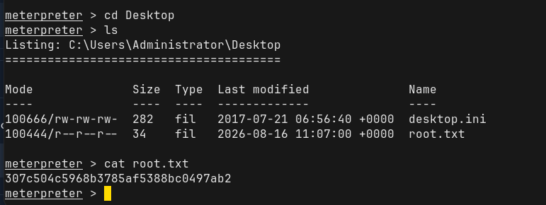

# Walkthrough 


## Information Gathering: 


### Nmap Scans: 

All ports scan: 

```
PORT      STATE SERVICE
135/tcp   open  msrpc
139/tcp   open  netbios-ssn
445/tcp   open  microsoft-ds
49152/tcp open  unknown
49153/tcp open  unknown
49154/tcp open  unknown
49155/tcp open  unknown
49156/tcp open  unknown
49157/tcp open  unknown
```


`-sC -sV` scan:
```
PORT      STATE SERVICE      VERSION
135/tcp   open  msrpc        Microsoft Windows RPC
139/tcp   open  netbios-ssn  Microsoft Windows netbios-ssn
445/tcp   open  microsoft-ds Windows 7 Professional 7601 Service Pack 1 microsoft-ds (workgroup: WORKGROUP)
49152/tcp open  msrpc        Microsoft Windows RPC
49153/tcp open  msrpc        Microsoft Windows RPC
49154/tcp open  msrpc        Microsoft Windows RPC
49155/tcp open  msrpc        Microsoft Windows RPC
49156/tcp open  msrpc        Microsoft Windows RPC
49157/tcp open  msrpc        Microsoft Windows RPC
Service Info: Host: HARIS-PC; OS: Windows; CPE: cpe:/o:microsoft:windows

Host script results:
| smb2-security-mode:
|   2.1:
|_    Message signing enabled but not required
| smb-security-mode:
|   account_used: guest
|   authentication_level: user
|   challenge_response: supported
|_  message_signing: disabled (dangerous, but default)
| smb2-time:
|   date: 2026-08-16T11:24:57
|_  start_date: 2026-08-16T11:06:15
| smb-os-discovery:
|   OS: Windows 7 Professional 7601 Service Pack 1 (Windows 7 Professional 6.1)
|   OS CPE: cpe:/o:microsoft:windows_7::sp1:professional
|   Computer name: haris-PC
|   NetBIOS computer name: HARIS-PC\x00
|   Workgroup: WORKGROUP\x00
|_  System time: 2026-08-16T12:24:58+01:00
|_clock-skew: mean: -19m56s, deviation: 34m37s, median: 1s
```


## Vulnerability Assessment: 


EternalBlue is one of the most famous exploits targetting Windows Machines. It targets port 445 on unpatched Windows machines using Microsoft's Server Message Block (SMBv1) protocol. 

The Metasploit module `auxiliary(scanner/smb/smb_ms17_010)` was run against the target and found it to be likely vulnerable MS17-010 which is the EternalBlue exploit. 


---

## Exploitation: 

The Metasploit module exploit(windows/smb/ms17_010_eternalblue) was run against the target and successfully landed a Meterpreter shell. 

Due to the severity of the EternalBlue exploit, access to the machine is obtained at a privileged level:

```
meterpreter > getuid
Server username: NT AUTHORITY\SYSTEM
```

After gaining initial access to the target, the system was enumerated to reveal the `haris` user. The first flag was found in `C:\Users\haris\Desktop\user.txt`. 

Having already obtained Administrator access via the EternalBlue access, the Administrator user was enumerated and the root flag was located in `C:\Users\Administrator\Desktop\root.txt`:



---

# Summary: 

The assessment identified a Windows 7 Professional SP1 host exposing SMB services over ports 139 and 445, alongside multiple Microsoft RPC services. SMB security controls were found to be weak, with message signing disabled/not required. Vulnerability assessment confirmed that the host was likely vulnerable to MS17-010 (EternalBlue), an SMB vulnerability affecting unpatched Windows systems. Exploitation of MS17-010 was successfully performed using Metasploit, resulting in a Meterpreter session with `NT AUTHORITY\SYSTEM` privileges. This provided full administrative control of the target without requiring further privilege escalation. Post-exploitation enumeration identified the `haris` user and enabled retrieval of the user flag from the user's desktop, while the existing SYSTEM-level access also allowed enumeration of the Administrator profile and retrieval of the root flag. The primary security issue was the use of an outdated and vulnerable Windows operating system combined with insufficient SMB security controls, resulting in complete compromise of the host.


