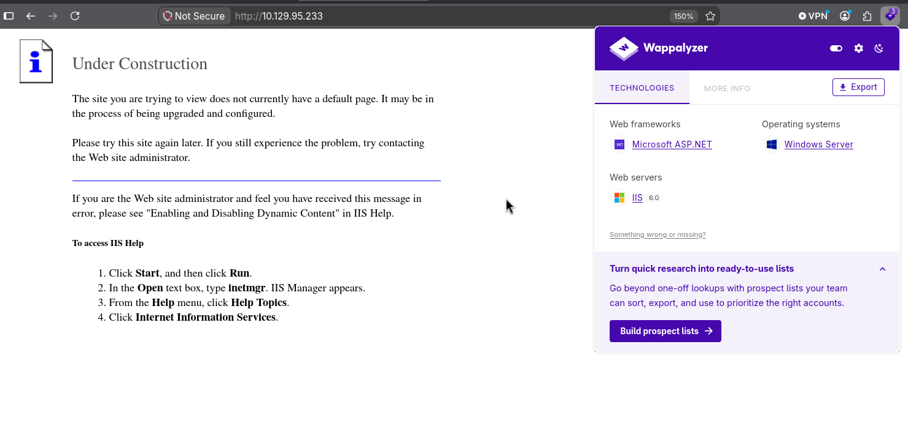
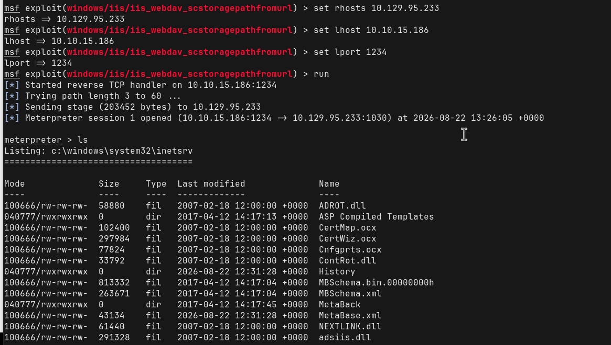
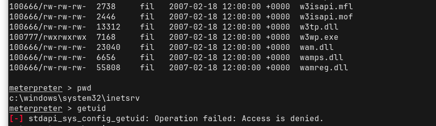
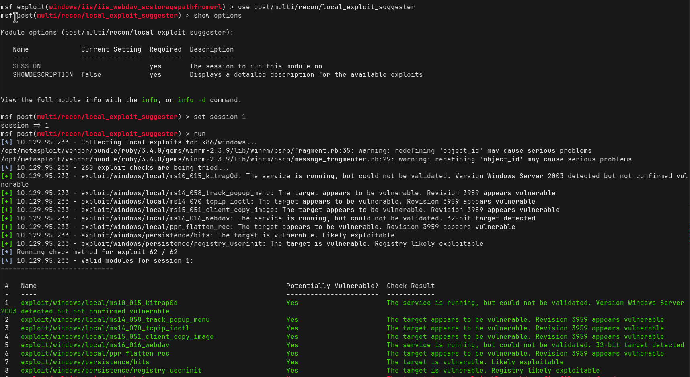
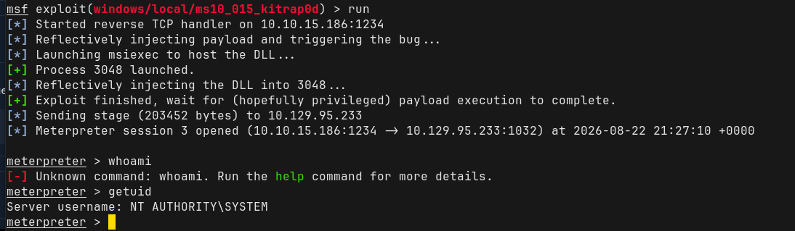
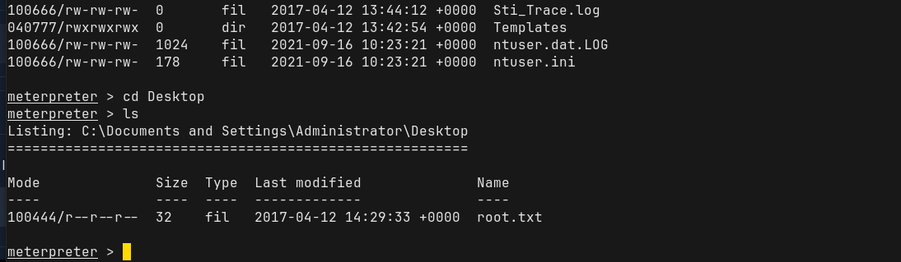

# Walkthrough 


## Information Gathering: 




---
### Nmap Scans: 

```
PORT   STATE SERVICE
80/tcp open  http
```

Port 80 is the only open port on the target.

```
PORT   STATE SERVICE VERSION
80/tcp open  http    Microsoft IIS httpd 6.0
| http-methods:
|_  Potentially risky methods: TRACE COPY PROPFIND SEARCH LOCK UNLOCK DELETE PUT MOVE MKCOL PROPPATCH
| http-webdav-scan:
|   Public Options: OPTIONS, TRACE, GET, HEAD, DELETE, PUT, POST, COPY, MOVE, MKCOL, PROPFIND, PROPPATCH, LOCK, UNLOCK, SEARCH
|   Server Type: Microsoft-IIS/6.0
|   Server Date: Sat, 22 Aug 2026 12:47:30 GMT
|   Allowed Methods: OPTIONS, TRACE, GET, HEAD, COPY, PROPFIND, SEARCH, LOCK, UNLOCK
|_  WebDAV type: Unknown
|_http-title: Under Construction
|_http-server-header: Microsoft-IIS/6.0
Service Info: OS: Windows; CPE: cpe:/o:microsoft:windows

Service detection performed. Please report any incorrect results at https://nmap.org/submit/ .
Nmap done: 1 IP address (1 host up) scanned in 41.88 seconds
```


---
### Directory Enumeration: 

`gobuster -w common.txt`:
```
Images               (Status: 301) [Size: 151] [--> http://10.129.95.233/Images/]
_private             (Status: 403) [Size: 1529]
_vti_cnf             (Status: 403) [Size: 1529]
_vti_log             (Status: 403) [Size: 1529]
_vti_bin             (Status: 301) [Size: 157] [--> http://10.129.95.233/%5Fvti%5Fbin/]
_vti_pvt             (Status: 403) [Size: 1529]
_vti_txt             (Status: 403) [Size: 1529]
_vti_bin/_vti_adm/admin.dll (Status: 200) [Size: 195]
_vti_bin/_vti_aut/author.dll (Status: 200) [Size: 195]
_vti_bin/shtml.dll   (Status: 200) [Size: 96]
aspnet_client        (Status: 403) [Size: 218]
images               (Status: 301) [Size: 151] [--> http://10.129.95.233/images/]
Progress: 4752 / 4752 (100.00%)
```


---
### Burpsuite: 

I used Burp's proxy to try and indentify the sever by capturing a request of the webpage:

```
HTTP/1.1 200 OK
Content-Length: 1433
Content-Type: text/html
Content-Location: http://10.129.95.233/iisstart.htm
Last-Modified: Fri, 21 Feb 2003 15:48:30 GMT
Accept-Ranges: bytes
ETag: "05b3daec0d9c21:300"
Server: Microsoft-IIS/6.0
MicrosoftOfficeWebServer: 5.0_Pub
X-Powered-By: ASP.NET
Date: Sat, 22 Aug 2026 13:19:22 GMT
```

The IIS server is version 6.0
MSOfficeWebServer is 5.0_Pub

---

## Vulnerability Assessment: 

Microsoft Internet Information Services (IIS) 6.0 contains a critical remote code execution flaw tracked as **CVE-2017-7269**. It involves a buffer overflow in the WebDAV `ScStoragePathFromUrl` function via an overly large `IF` header in a `PROPFIND` request on Windows Server 2003.

Metasploit allows an attacker to automate this process via the exploit module below:
`exploit/windows/iis/iis_webdav_scstoragepathfromurl `  

---
## Exploitation:







---

## Post-Exploitation & Privilege Escalation: 

Metasploits `exploit suggester` was used after obtaining initial access:



When using the exploit `exploit/windows/local/ms10_015_kitrap0d` through metasploit, an error was found:

```
stdapi_sys_config_getsid:
Operation failed: Access is denied
```

This was likely due to the original Meterpreter process being in a context where Metasploit couldn't perform one of the preliminary token operations. This same error occured when trying to run `getuid` as well. 

The next step was to `migrate` the Meterpreter shell to a different process. In this case:

```
1832 584 davcdata.exe x86 0 NT AUTHORITY\NETWORK SERVICE C:\WINDOWS\system32\inetsrv\davcdata.exe
```

Now the exploit can be run against the target:



The exploit is successful in escalating privileges and a root shell is obtained. 

The user flag was found in `C:\Documents and Settings\Harry\Desktop\user.txt` 

The root flag is found in `C:\Documents and Settings\Administrator\Desktop\root.txt`




---

# Summary: 

The assessment identified a Microsoft IIS 6.0 WebDAV server running on Windows Server 2003. The exposed WebDAV functionality was vulnerable to **CVE-2017-7269**, a buffer-overflow vulnerability in the `ScStoragePathFromUrl `function.

The vulnerability was successfully exploited to obtain an initial Meterpreter shell running in the context of `NT AUTHORITY\NETWORK SERVICE`.

Post-exploitation enumeration identified additional privilege-escalation opportunities. Initial attempts using Metasploit's local exploit modules failed because the Meterpreter session was operating in a restricted process context. Migrating the Meterpreter session to the IIS `davcdata.exe` process allowed the privilege-escalation exploit to execute successfully, resulting in SYSTEM-level access.

Both the user-level and administrator/root-level flags were subsequently recovered.