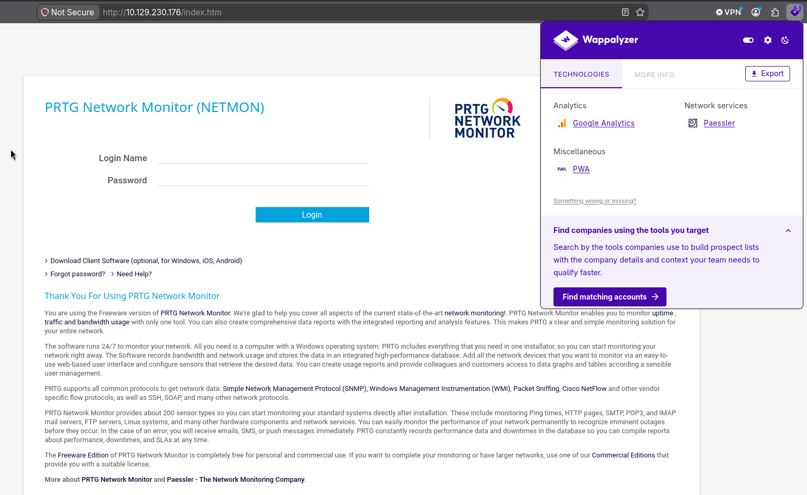
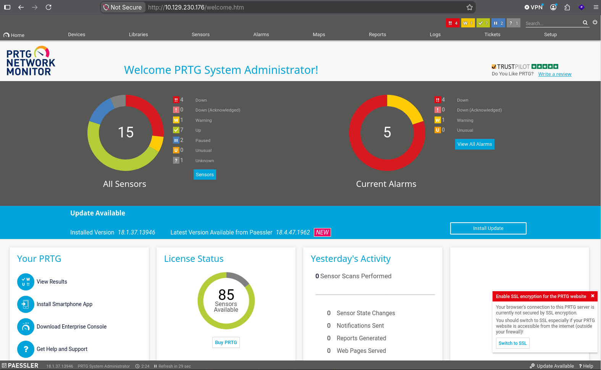
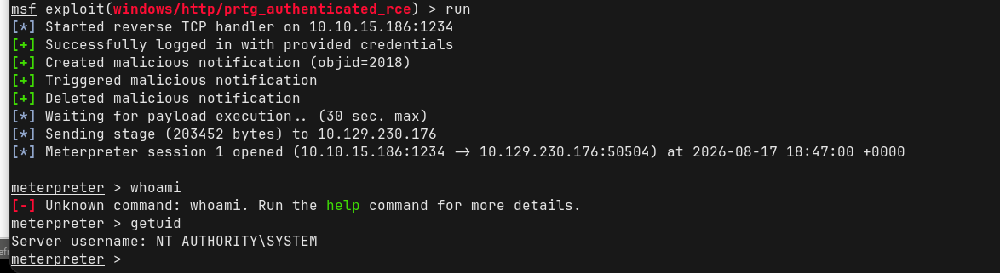

# Walkthrough


## Information Gathering: 


The target ip resolves to the following webpage: 




#### Page-source: 

Line 180 of the pagesource: `<span class="prtgversion">&nbsp;PRTG Network Monitor 18.1.37.13946 </span>`

The target is running **Version 18.1.37.13946** PRTG Network Monitor

Default credentials for this service are: 
`prtgadmin:prtgadmin` 

But the default credentials have been changed. 

---
### Nmap Scans: 

Open ports:
```
PORT     STATE SERVICE
21/tcp   open  ftp
80/tcp   open  http
135/tcp  open  msrpc
139/tcp  open  netbios-ssn
445/tcp  open  microsoft-ds
5985/tcp open  wsman
```


```
PORT     STATE SERVICE      VERSION
21/tcp   open  ftp          Microsoft ftpd
| ftp-anon: Anonymous FTP login allowed (FTP code 230)
| 02-03-19  12:18AM                 1024 .rnd
| 02-25-19  10:15PM       <DIR>          inetpub
| 07-16-16  09:18AM       <DIR>          PerfLogs
| 02-25-19  10:56PM       <DIR>          Program Files
| 02-03-19  12:28AM       <DIR>          Program Files (x86)
| 02-03-19  08:08AM       <DIR>          Users
|_11-10-23  10:20AM       <DIR>          Windows
| ftp-syst:
|_  SYST: Windows_NT
80/tcp   open  http         Indy httpd 18.1.37.13946 (Paessler PRTG bandwidth monitor)
|_http-trane-info: Problem with XML parsing of /evox/about
|_http-server-header: PRTG/18.1.37.13946
| http-title: Welcome | PRTG Network Monitor (NETMON)
|_Requested resource was /index.htm
135/tcp  open  msrpc        Microsoft Windows RPC
139/tcp  open  netbios-ssn  Microsoft Windows netbios-ssn
445/tcp  open  microsoft-ds Microsoft Windows Server 2008 R2 - 2012 microsoft-ds
5985/tcp open  http         Microsoft HTTPAPI httpd 2.0 (SSDP/UPnP)
|_http-title: Not Found
|_http-server-header: Microsoft-HTTPAPI/2.0
Service Info: OSs: Windows, Windows Server 2008 R2 - 2012; CPE: cpe:/o:microsoft:windows

Host script results:
| smb2-time:
|   date: 2026-08-16T15:56:42
|_  start_date: 2026-08-16T15:18:45
|_clock-skew: mean: -21s, deviation: 0s, median: -22s
| smb-security-mode:
|   authentication_level: user
|   challenge_response: supported
|_  message_signing: disabled (dangerous, but default)
| smb2-security-mode:
|   3.1.1:
|_    Message signing enabled but not required
```


The FTP service allows anonymous authentication and this allows an attacker access to enumerate part of the system. 

The first flag is accessible and can be found in `~\Public\Desktop\user.txt`. 

By allowing `anonymous` login to the FTP service, an attacker can login and access the backup file of the running service: 
`C:\ProgramData\Paessler\PRTG Network Monitor\PRTG Configuration.old.bak`.

This files contains the credentials below:
```
prtgadmin
PrTg@dmin2018
```

The credentials above did not grant access to the prtgadmin account. It is likely that the system administrators may have enforced password policy and the password was changed. By changing the date from 2018 to 2019, the year in which this machine launched, an attacker is able to obtain access to the admin dashboard. The valid credentials are:

```
prtgadmin
PrTg@dmin2019
```





---
## Vulnerability Assessment: 


### CVE-2018-9276

An OS command injection vulnerability exists in PRTG Network Monitor versions prior to **18.2.39.** An authenticated attacker with administrative privileges can inject arbitrary OS commands into malformed parameters inside sensor notification parameters or system management scripts, executing code with full SYSTEM or administrative privileges on the host server.

Metasploit has a module to automate this exploit:
```
exploit(windows/http/prtg_authenticated_rce
```


---

## Exploitation: 

Using the Metasploit module to automate the exploitation of CVE-2018-9276 works and successfully provides a shell: 



Because CVE-2018-9276 is an OS command injection in PRTG, the command is ultimately executed by the Windows process that runs the PRTG service.

On this machine, that service is running with LocalSystem (`NT AUTHORITY\SYSTEM`) privileges. Therefore, when the Metasploit module successfully injects a command, Windows executes that command in the security context of the PRTG service.

The result is full compromise and takeover of the target and the root flag can be obtained. 


---

# Summary: 

The assessment identified multiple security weaknesses in the target, beginning with an anonymously accessible FTP service that exposed sensitive system directories and a PRTG configuration backup file. Credentials recovered from this backup enabled authenticated access to PRTG Network Monitor 18.1.37.13946, which was found to be vulnerable to CVE-2018-9276, an authenticated OS command injection vulnerability. Exploitation of the vulnerability resulted in arbitrary command execution through the PRTG service and provided a shell running as `NT AUTHORITY\SYSTEM`, granting full administrative control of the host. The assessment therefore demonstrated a complete compromise of the target through the combination of anonymous FTP access, exposed credentials, and an outdated vulnerable PRTG installation.